# EZ Shopper

EZ Shopper is an e-commerce web application built using Laravel, Bootstrap, Tailwind CSS, JavaScript, and MySQL. This platform provides a seamless shopping experience for users and robust management tools for administrators.

## Features

### General
- **Login and Register**: Secure user authentication.
- **Home Page**: A welcoming interface for users to explore products.

### Admin
- **Admin Dashboard**: Comprehensive overview of orders and products.
- **Show All Orders**: View detailed order history.
- **Add Product**: Add new products to the store.
- **Add Category**: Organize products into categories.
- **Email Notification**: Notify customers about their orders via email.
- **Download PDF**: Export detailed order information for each customer.

### User
- **All Products**: Browse the complete product catalog.
- **Product Description**: View detailed descriptions of each product.
- **Cart**: Add products to the cart and manage them.
- **Payment by Card**: Secure payment integration using Stripe.
- **Payment Info**: View payment details and history.
- **Comment and Reply Section**: Engage with product reviews and discussions.

## Technologies Used

- **Backend**: Laravel
- **Frontend**: Bootstrap, Tailwind CSS, JavaScript
- **Database**: MySQL
- **Payment Gateway**: Stripe

## Installation

Follow these steps to set up the project locally:

1. Clone the repository:
    ```bash
    git clone "https://github.com/gihantha/EZShopper_ecommerce"
    ```

2. Navigate to the project directory:
    ```bash
    cd EZShopper
    ```

3. Install dependencies:
    ```bash
    composer install
    npm install
    ```

4. Create a `.env` file and configure your environment variables (database credentials, Stripe keys, etc.).

5. Run migrations to set up the database:
    ```bash
    php artisan migrate
    ```

6. Start the development server:
    ```bash
    php artisan serve
    npm run dev
    ```

7. Access the application in your browser at `http://localhost:8000`.

## Screenshots

### General

**Login Page:**
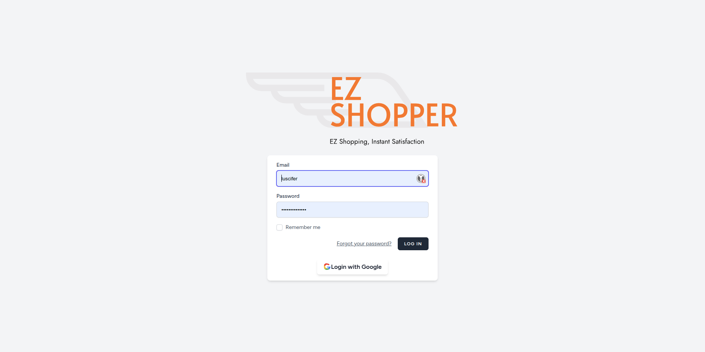

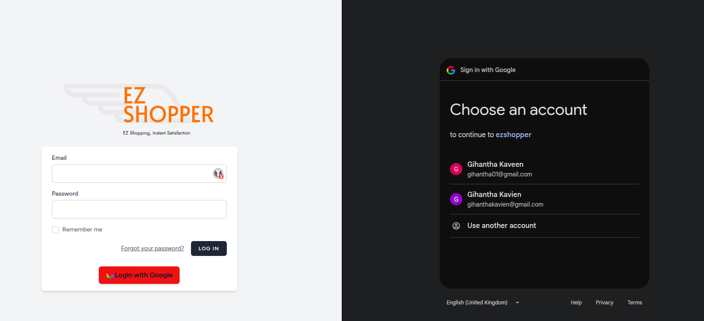

**Register Page:**
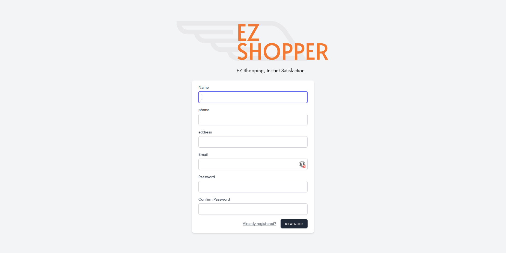

**Home Page:**


### Admin

**Admin Dashboard:**
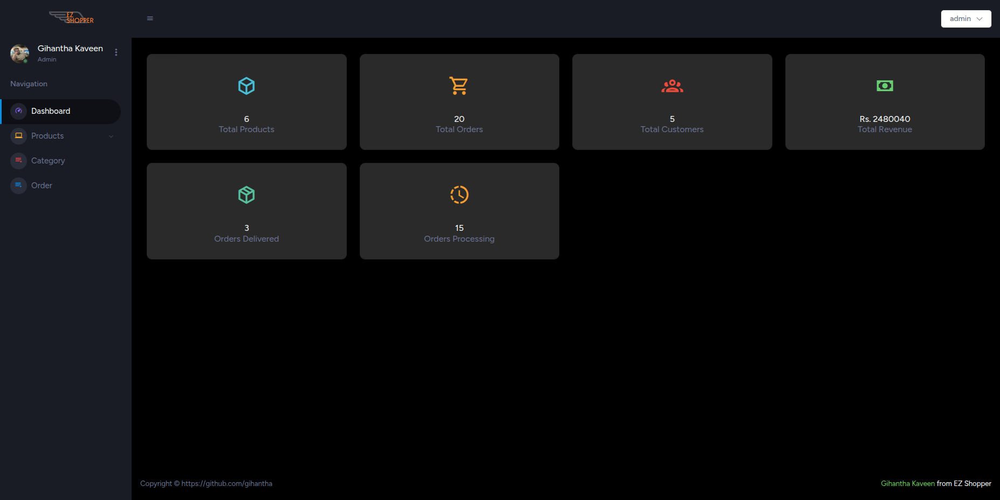

**Show All Orders:**
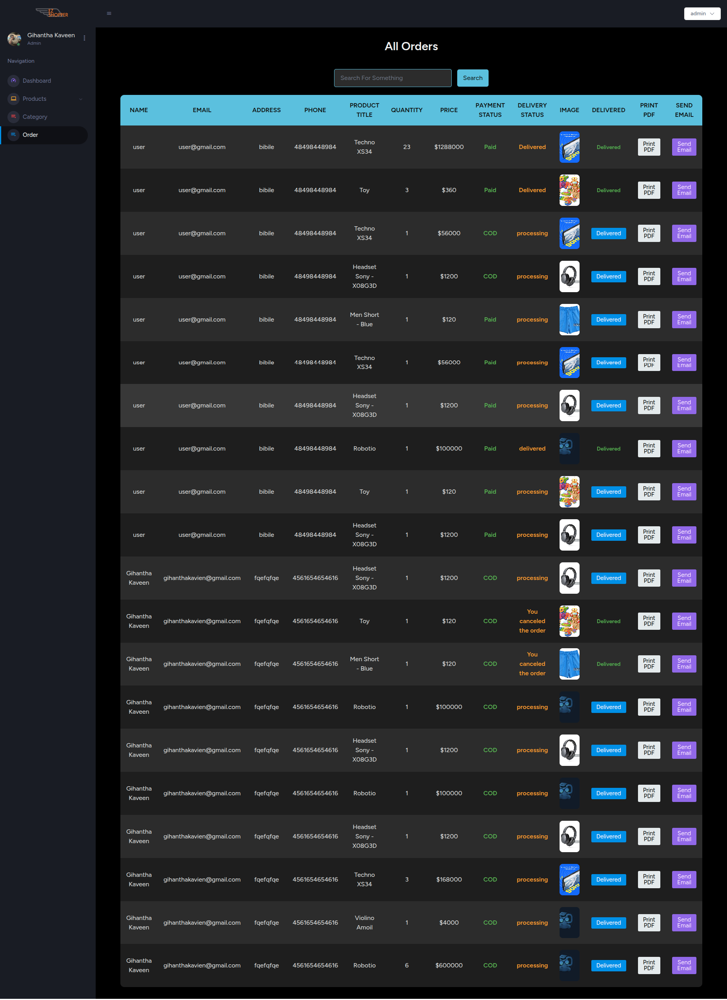

**Add Product:**
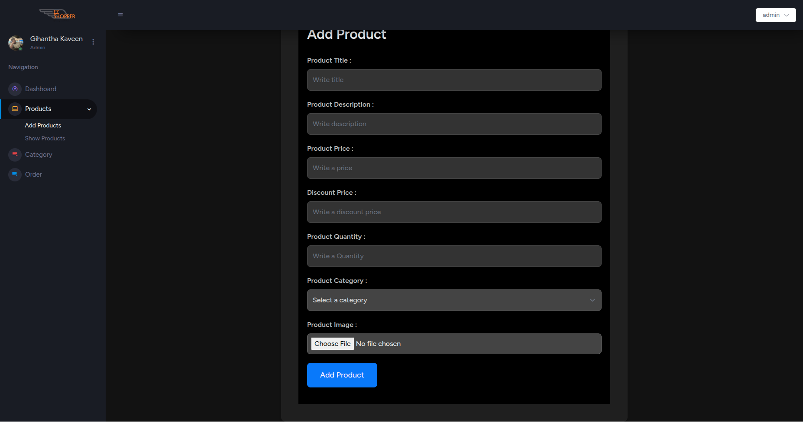


**Show All Products:**
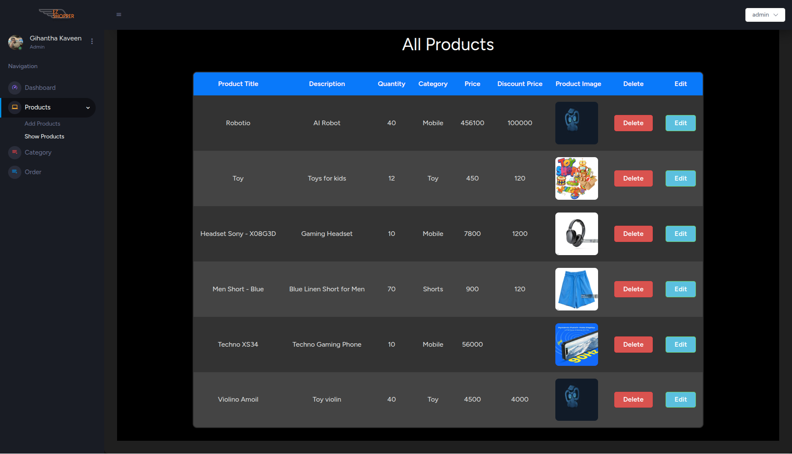

**Add Category:**
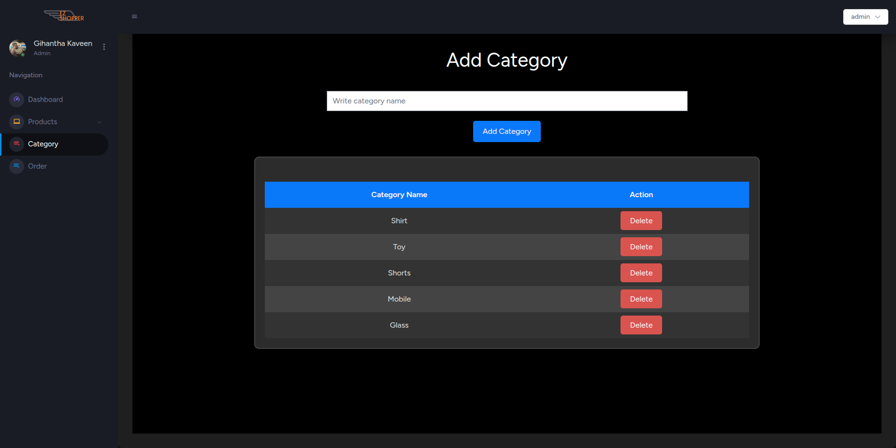

**Email Notification:**
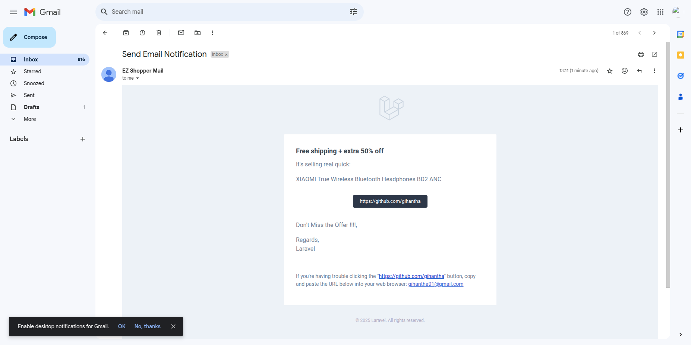

**Download PDF:**
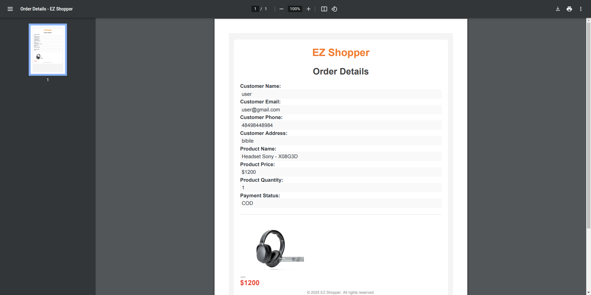

**Payment Details Stripe:**
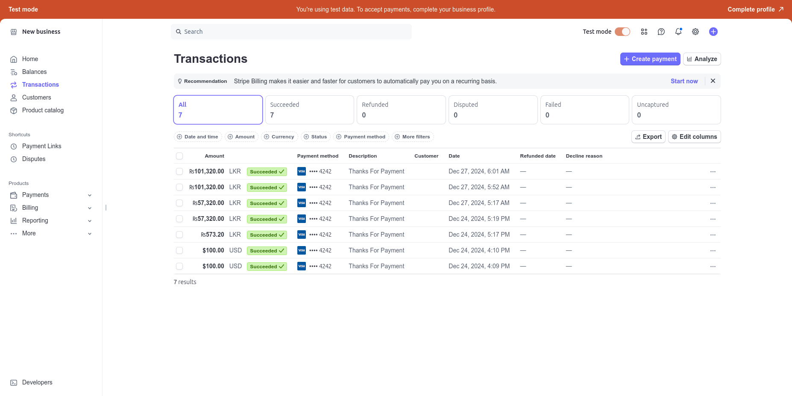


### User

**All Products:**
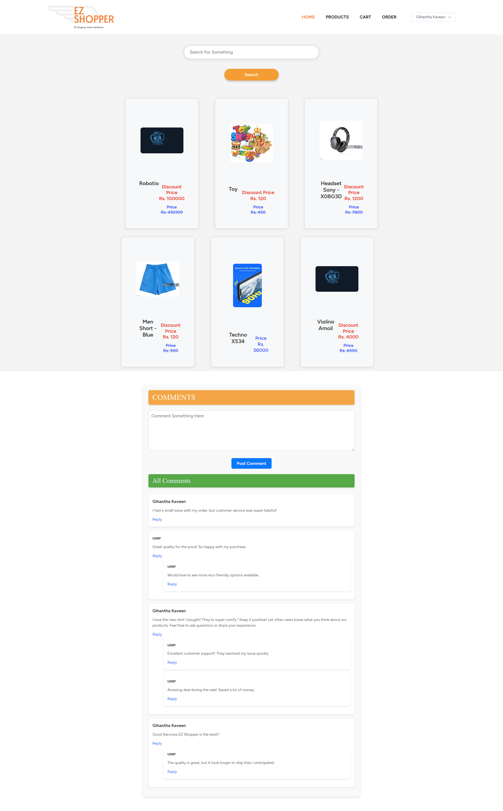

**Product Description:**
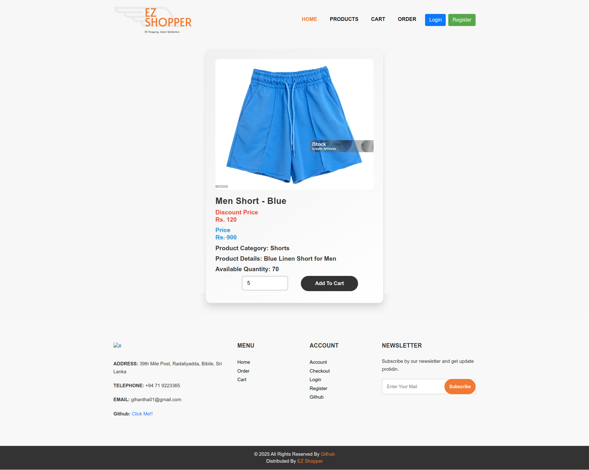

**Cart:**
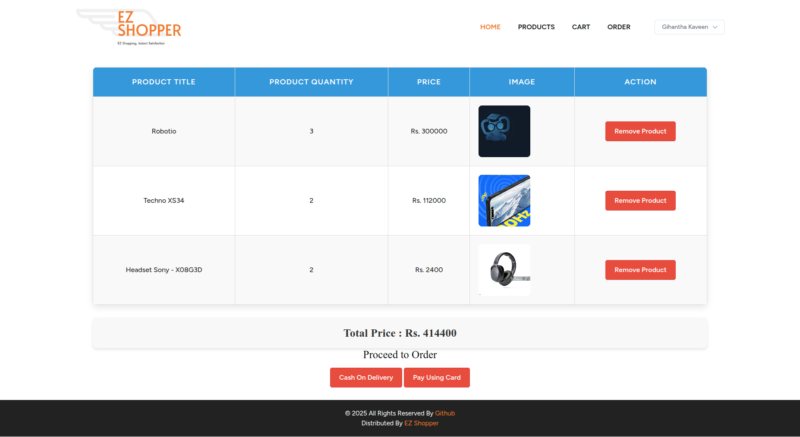

**Payment by Card:**
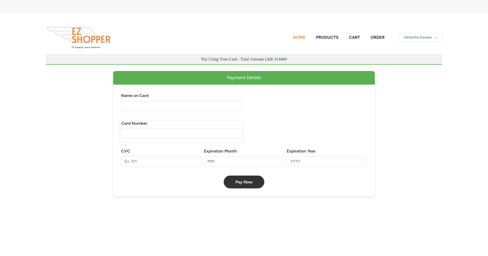

**Comment Section:**
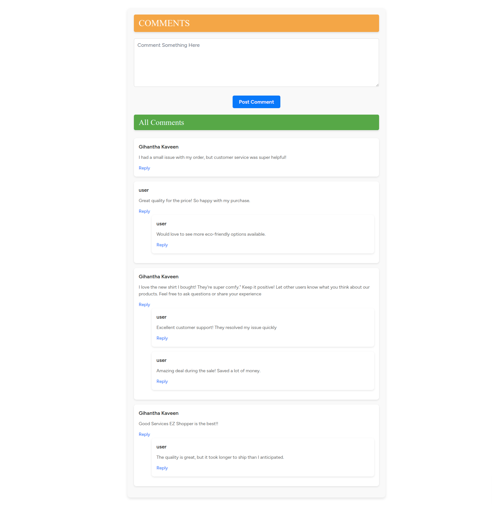

## License

This project is licensed under the [MIT License](LICENSE).

## Contributions

Contributions are welcome! Feel free to submit a pull request or open an issue for suggestions and improvements.

## Contact

For further inquiries or support, please contact gihantha01@gmail.com.
